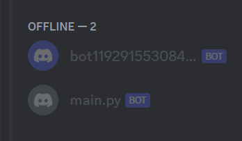
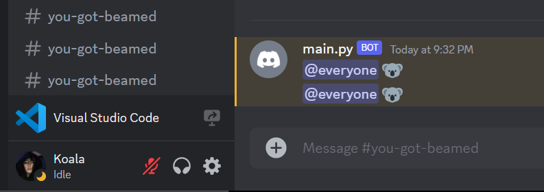
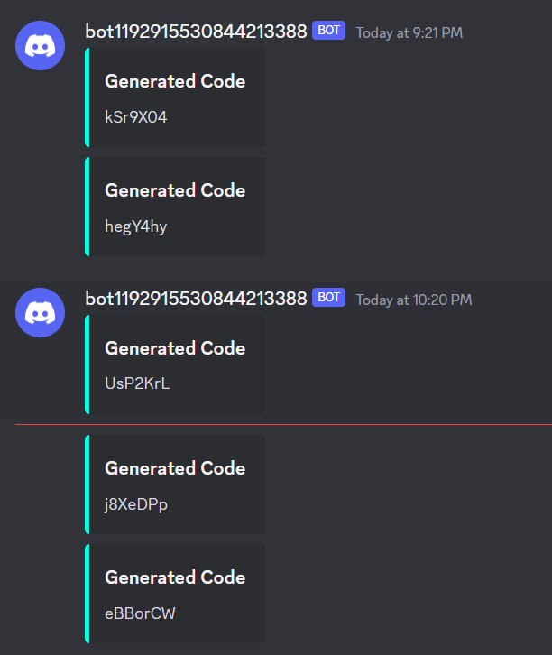

# WIZZHUT BLUEPRINT
- Tried to make something that people can use to nuke discord servers for free or money (with better perks and custom stuff) but quit halfway through because I lost interest in the topic.

- The script is not licensed hence if you decide to use any of the code, kindly drop credits to my github account :D

# PREVIEW
- One of the bots is to generate and manage the backend and the other bot is to nuke the given server. Both the bots can check the auth, the nuker can only read it whereas the backend bot can append, edit and read the file and even delete the files and remake everything

